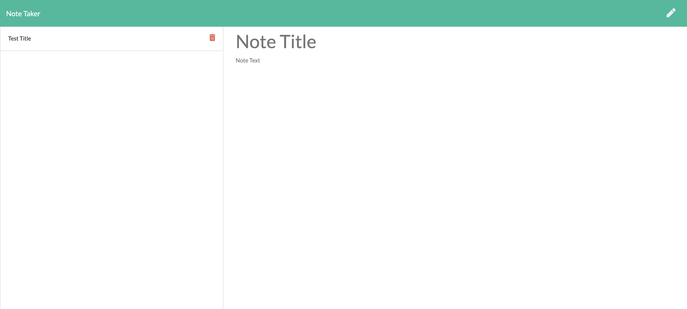
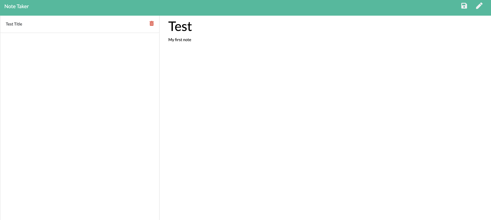
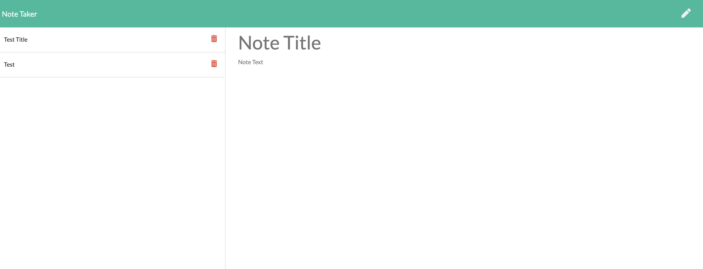

# NoteTaker

## Description
This Application called Note Taker that can be used to write and save notes. This application will use an Express.js back end and will save and retrieve note data from a JSON file.

## Table of Contents
* [Features](#features)
* [Installation](#installation)
* [Known Bugs](#known-bugs)
* [Support](#support)
* [Technologies Used](#technologies-used)
* [Contribution Guidlines](#contribution-guidlines)
* [License](#license)

## Features
* Create a note by entering Title and Text

* Save button appears once the text is entered

* Notes saved in the left column 

## Installation 
* Clone this repository.
* Open application live URL in your browser.

https://morning-shelf-52307.herokuapp.com/notes

## Tests

* There are no tests yet for this application

## Known Bugs
None

## Support
Please email me for further questions at nasozontova@gmail.com

## Technologies Used
NodeJS
JavaScript
Express
Heroku

## Contribution Guidlines
Direct link to repository: https://github.com/NataliaSozontova/week11NoteTaker

## License
Copyright(c) 2021 Natalia Sozontova.